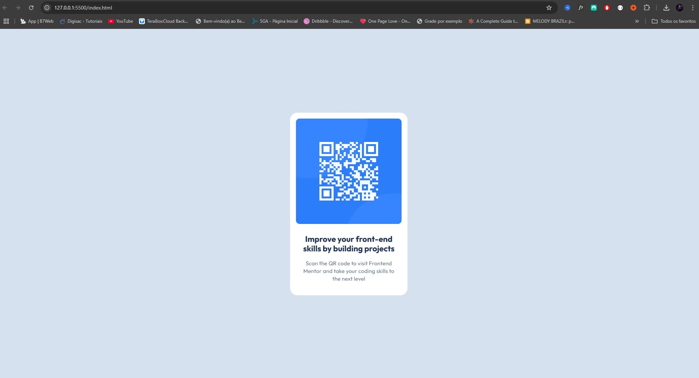

# Frontend Mentor - QR code component solution

This is a solution to the [QR code component challenge on Frontend Mentor](https://www.frontendmentor.io/challenges/qr-code-component-iux_sIO_H). Frontend Mentor challenges help you improve your coding skills by building realistic projects. 

### Screenshot

### Links

- Live Site URL: [Add live site URL here](https://your-live-site-url.com)

## My process

### Built with

- Semantic HTML5 markup
- CSS custom properties
- Flexbox

### What I learned

In this small project I had the opportunity to learn/optimize my knowledge and techniques about semantic HTML, FLEXBOX, BoxShadow and design from prototyping in Figma.

The project was implemented using HTML5 and CSS3 concepts without styling or third-party libraries, just pure concepts.

### Continued development

My plans for the future are to continue studying in depth the concepts of web development with javascript and to use modern technologies with react, tailwindcss, nodejs. But always revisiting concepts from the base of the web html, css and js

### Useful resources

- [Squash.app](https://squoosh.app/) - excellent image compression tool for the web. This is what was used to compress the screenshot for this project

## Author
- Frontend Mentor - [@Adriel Teles](https://www.frontendmentor.io/profile/AdrielTeles97)

